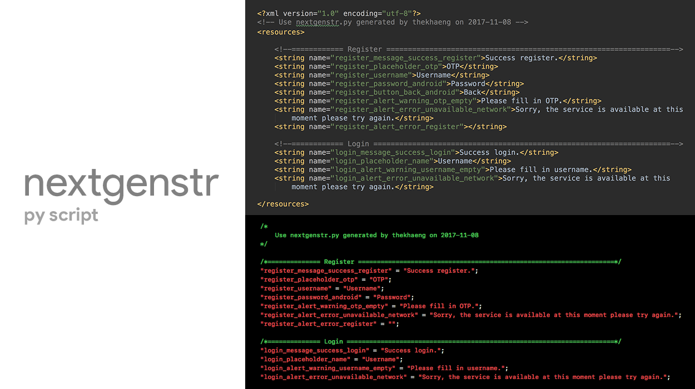
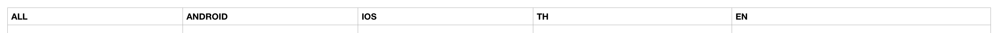
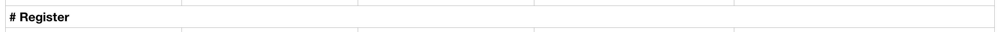
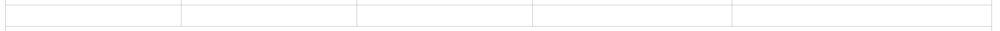
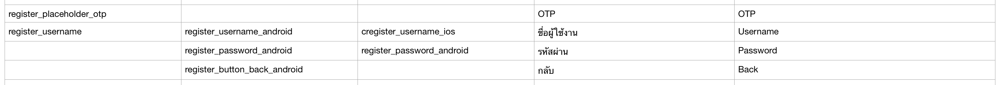

# **「 Nextzy Generate String Resoruce 」**



Python sript for generate string from csv file to iOS and Android resource.

### 「 UPDATE 」
 - version 1.0 beta
    - test on 
        - mac osx
        - python 2.7.x

## 「 USAGE 」

install python 2.7.x before :)

``` 
> python nextgenstr.py [-OPTION] <csv_file>
```

### 「 OPTION 」
- d : add date to generate folder 
    - ex: generate-folder/... --> generate-folder-2017-11-08/...

- commingsoon...

## 「 CSV SYNTAX 」


    
- first line: 4 or more column

|ALL |ANDROID| IOS| <your_language>|
| ---|-------|----|----------------|





- comment: #



- space: all empty string



- string: field_name at least one



[csv example](./example_string.csv)


## 「 RESULT 」

```
[Genderate folder]

── <generate-folder>: depend on your csv file
 │
 ├─ android
 │    │
 │    └─ res
 │        ├─ value : english by default
 │        │    └ string.xml
 │        │
 │        ├─ value-th
 │        │    └ string.xml
 │        │
 │        └─ ...
 │
 └─ ios:  
     ├─ en.lporj
     │   └ Localizable.strings
     │
     ├─ th.lproj
     │   └ Localizable.strings
     │
     └─ ...
```

```xml
Android [string.xml]

<?xml version="1.0" encoding="utf-8"?>
<!-- Use nextgenstr.py generated by thekhaeng on 2017-11-08 -->
<resources>

	<!--============ Register ==================================================================-->
	<string name="register_message_success_register">Success register.</string>
	<string name="register_placeholder_otp">OTP</string>
	<string name="register_username">Username</string>
	<string name="register_password_android">Password</string>
	<string name="register_button_back_android">Back</string>
	<string name="register_alert_warning_otp_empty">Please fill in OTP.</string>
	<string name="register_alert_error_unavailable_network">Sorry, the service is available at this moment please try again.</string>
	<string name="register_alert_error_register"></string>

	<!--============ Login =====================================================================-->
	<string name="login_message_success_login">Success login.</string>
	<string name="login_placeholder_name">Username</string>
	<string name="login_alert_warning_username_empty">Please fill in username.</string>
	<string name="login_alert_error_unavailable_network">Sorry, the service is available at this moment please try again.</string>

</resources>

```

```swift
iOS [Localizable.strings]

/*
 Use nextgenstr.py generated by thekhaeng on 2017-11-08
*/

/*============== Register ====================================================================*/
"register_message_success_register" = "Success register.";
"register_placeholder_otp" = "OTP";
"register_username" = "Username";
"register_password_android" = "Password";
"register_alert_warning_otp_empty" = "Please fill in OTP.";
"register_alert_error_unavailable_network" = "Sorry, the service is available at this moment please try again.";
"register_alert_error_register" = "";

/*============== Login =======================================================================*/
"login_message_success_login" = "Success login.";
"login_placeholder_name" = "Username";
"login_alert_warning_username_empty" = "Please fill in username.";
"login_alert_error_unavailable_network" = "Sorry, the service is available at this moment please try again.";


```

# Licence

Copyright 2017 Nextzy Technologies Co.,ltd

Licensed under the Apache License, Version 2.0 (the "License"); you may not use this work except in compliance with the License. You may obtain a copy of the License in the LICENSE file, or at:

http://www.apache.org/licenses/LICENSE-2.0

Unless required by applicable law or agreed to in writing, software distributed under the License is distributed on an "AS IS" BASIS, WITHOUT WARRANTIES OR CONDITIONS OF ANY KIND, either express or implied. See the License for the specific language governing permissions and limitations under the License.


### Developed By Thai android developer.


Follow [facebook.com/nextzy](https://www.facebook.com/nextzy) on Facebook page.
or [Nextzy blog](https://blog.nextzy.me/) at our Medium blog. :)

For contact, shoot me an email at geek@nextzy.com
